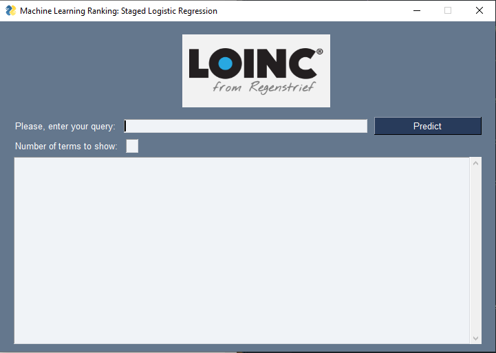

# Machine Learning Ranking

In this directory you con find a machine learning ranker for the LOINC clinical terminology based on the approach proposed in [(Cooper et al. (1992))](papers/p198-cooper.pdf).

## Application



## Dataset

The dataset for this algorithm is pretty simple. It is made up of a combination of each query, term pair including the binary relevance of that term for the given query.

**Example:**

*query1, term1, 1* - *query1, term2, 0* - *query2, term1, 0* - ...


## Algorithm

This ranker consists of an implementation of a staged logistic algorithm, used for the probabilistic retrieval of the terms.

The algorithm computes the probability of a term being relevant given a query as a combination of the probability of the term being relevant and a linear combination of the partial probabilities of the term being relevant given a specific word.

Once the probabilities of each term being relevant are computed, the terms are sorted according to them.


In the above formula, we can see the terms explained in the previous paragraph:
- Probability of a term being relevant given some words: Log O(R|A1, A2, ..., An)
- Probability of a term being relevant: Log O(R)
- Probability of a term being relevant given a particular word: Log O(R|A1)

### Probability of a specific term being relevant

The estimation of Log O(R) from a learning set is a straightforward matter, for the simple proportion query-term pairs in the learning set that are relevance-related can be used to estimate it.

### Probability of a term being relevant given a particular word

This is the most difficult part of the algorithm. It´s very likely that in a dataset aren´t enough query-document pairs with the property Ai to yield reliable estimates of P(R|Ai) and P(R|~Ai). Being Ai a unique word of the query.

So we have to somehow express each Ai in terms of some independet variables, that is, computing Log(R|Ai) as Log(R|X1, X2, ..., Xm). 

These Xi should be some facts about Ai. In our case, we have consider:
1. X1: relative frequency of the word in the query.
2. X2: tfidf of the word.

---

## Getting started

### Installing the requirements

Get into the `src` folder and run
   ```
   pip install -r requirements.txt
   ```

### Creating the classifier

Execute the file file `ranker.py` in order to generate the classifier.
   ```
   python ranker.py <path to your dataset>
   ```
> You will be asked whether you want or not to save the model, **please say "y"** (yes). This will generate two files: `classifier.joblib` and `logor.joblib`.

### Making predictions

Once the model has been created, you are able to execute the `mlranker.py` file.
   ```
   python mlranker.py
   ```
1. First, you will be asked to load the dataset. 

> You can load either the `dataset_wide.csv` or `dataset_restrictive`.
2. Secondly, you will need to load your `classifier.joblib` and `logor.joblib`.


3. Now you are able to make predictions. Just write a query and choose the number of recommendations you want to be shown and click on Predict. And voilá, your recommendations will be shown.
    


